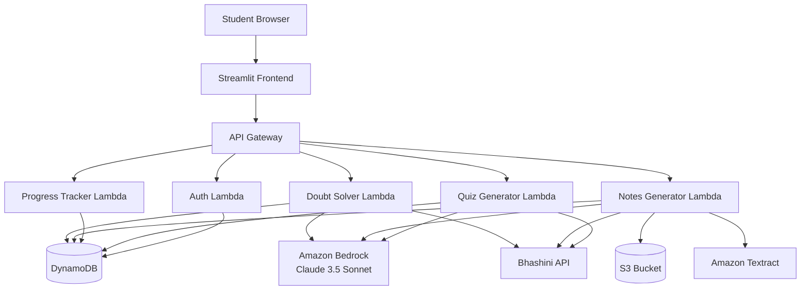

# Design Document: IndicScholar AI

## Overview

IndicScholar AI is a serverless, multilingual educational platform built on AWS infrastructure. The system leverages Amazon Bedrock (Claude 3.5 Sonnet) for intelligent tutoring, AI4Bharat's Bhashini API for high-accuracy Indic language translation, and a suite of AWS services for scalable, cost-effective operation.

The architecture follows a microservices pattern with AWS Lambda functions handling discrete operations, API Gateway managing HTTP endpoints, DynamoDB providing low-latency data storage, and S3 storing media files. The frontend uses Streamlit for rapid development of an interactive student interface.

## Architecture

### High-Level Architecture



### Technology Stack

- **Frontend**: Streamlit (Python-based web framework)
- **API Layer**: Amazon API Gateway (REST API)
- **Compute**: AWS Lambda (Python 3.11 runtime)
- **AI/ML**: Amazon Bedrock (Claude 3.5 Sonnet model)
- **Translation**: AI4Bharat Bhashini API
- **OCR**: Amazon Textract
- **Database**: Amazon DynamoDB
- **Storage**: Amazon S3
- **Authentication**: AWS Cognito (optional) or custom JWT-based auth

### Deployment Model

- Serverless architecture with automatic scaling
- Pay-per-use pricing model
- Multi-region deployment capability for low latency across India
- Infrastructure as Code using AWS SAM or Terraform

## Components and Interfaces

### 1. API Gateway

**Purpose**: Central entry point for all client requests

**Endpoints**:
- `POST /auth/login` - Student authentication
- `POST /auth/register` - New student registration
- `POST /doubt/ask` - Submit a doubt (text or voice)
- `POST /notes/generate` - Generate notes from uploaded content
- `GET /progress/dashboard` - Retrieve student progress data
- `POST /quiz/generate` - Generate adaptive quiz
- `POST /quiz/submit` - Submit quiz answers
- `PUT /student/language` - Update language preference

**Configuration**:
- Request validation using JSON schemas
- CORS enabled for Streamlit frontend
- Rate limiting: 100 requests per minute per student
- Request/response logging to CloudWatch

### 2. Authentication Lambda

**Purpose**: Manage student authentication and authorization

**Input**:
```python
{
  "action": "login" | "register",
  "email": str,
  "password": str,
  "preferred_language": str  # Only for registration
}
```

**Output**:
```python
{
  "success": bool,
  "token": str,  # JWT token
  "student_id": str,
  "message": str
}
```

**Logic**:
- Hash passwords using bcrypt
- Generate JWT tokens with 24-hour expiration
- Store student profiles in DynamoDB `Students` table
- Validate tokens on protected endpoints

### 3. Doubt Solver Lambda

**Purpose**: Process student questions and provide explanations

**Input**:
```python
{
  "student_id": str,
  "doubt_text": str | None,
  "doubt_audio_url": str | None,  # S3 URL if voice input
  "language": str,
  "subject": str | None
}
```

**Output**:
```python
{
  "explanation": str,
  "language": str,
  "related_topics": List[str],
  "interaction_id": str
}
```

**Processing Flow**:
1. If audio provided, transcribe using Bhashini speech-to-text API
2. Translate doubt from regional language to English using Bhashini
3. Construct prompt for Bedrock with context about Indian education and cultural analogies
4. Call Bedrock Claude 3.5 Sonnet with prompt
5. Translate response back to student's language using Bhashini
6. Log interaction to DynamoDB `Interactions` table
7. Return formatted explanation

**Bedrock Prompt Template**:
```
You are an educational tutor for Indian students. A student has asked the following question:

{translated_doubt}

Provide a clear, simplified explanation that:
1. Uses analogies relevant to Indian daily life and culture
2. Breaks down complex concepts into simple steps
3. Includes practical examples
4. Is appropriate for secondary school level

Keep the explanation concise (200-300 words).
```

### 4. Notes Generator Lambda

**Purpose**: Convert textbook photos and lecture audio into structured summaries

**Input**:
```python
{
  "student_id": str,
  "content_type": "image" | "audio",
  "s3_key": str,
  "target_language": str
}
```

**Output**:
```python
{
  "summary": str,
  "key_points": List[str],
  "topics_covered": List[str],
  "notes_id": str
}
```

**Processing Flow for Images**:
1. Retrieve image from S3
2. Extract text using Amazon Textract
3. Detect source language (use language detection library)
4. If source language != target language, translate using Bhashini
5. Send extracted text to Bedrock with summarization prompt
6. Format summary with headings and bullet points
7. Translate summary to target language if needed
8. Store summary in DynamoDB `Notes` table
9. Log interaction to `Interactions` table

**Processing Flow for Audio**:
1. Retrieve audio from S3
2. Transcribe using Bhashini speech-to-text
3. Send transcription to Bedrock with summarization prompt
4. Format and translate summary
5. Store and log as above

**Bedrock Prompt Template**:
```
You are creating study notes for an Indian student. Here is the source content:

{extracted_content}

Create a structured summary with:
1. Main Topic (heading)
2. Key Concepts (bullet points)
3. Important Definitions
4. Examples or Applications
5. Summary (2-3 sentences)

Format the output in clear sections with markdown headings.
```

### 5. Progress Tracker Lambda

**Purpose**: Analyze student interactions and identify learning gaps

**Input**:
```python
{
  "student_id": str,
  "time_range": str  # "week" | "month" | "all"
}
```

**Output**:
```python
{
  "total_study_time": int,  # minutes
  "topics_covered": List[str],
  "weak_topics": List[{
    "topic": str,
    "confidence_score": float,  # 0-1
    "interaction_count": int
  }],
  "quiz_performance": {
    "average_score": float,
    "total_quizzes": int
  },
  "recent_activities": List[{
    "timestamp": str,
    "activity_type": str,
    "topic": str
  }]
}
```

**Processing Logic**:
1. Query DynamoDB `Interactions` table for student's activities
2. Aggregate data by topic
3. Calculate confidence scores based on:
   - Number of repeated questions on same topic (negative indicator)
   - Quiz scores on topic (positive indicator)
   - Time since last interaction (recency weight)
4. Identify weak topics (confidence score < 0.6)
5. Format dashboard data
6. Return in student's preferred language

**Confidence Score Algorithm**:
```python
confidence_score = (
    quiz_average * 0.5 +
    (1 - repeat_question_ratio) * 0.3 +
    recency_factor * 0.2
)
```

### 6. Quiz Generator Lambda

**Purpose**: Create personalized quizzes based on weak topics

**Input**:
```python
{
  "student_id": str,
  "language": str,
  "num_questions": int,  # default: 10
  "difficulty": str | None  # "easy" | "medium" | "hard"
}
```

**Output**:
```python
{
  "quiz_id": str,
  "questions": List[{
    "question_id": str,
    "question_text": str,
    "question_type": "mcq" | "short_answer" | "true_false",
    "options": List[str] | None,  # For MCQ
    "topic": str
  }]
}
```

**Processing Flow**:
1. Retrieve student's weak topics from Progress Tracker
2. If no weak topics, select from recently studied topics
3. Construct prompt for Bedrock to generate questions
4. Parse Bedrock response into structured question format
5. Translate questions to target language using Bhashini
6. Store quiz in DynamoDB `Quizzes` table
7. Return quiz to student

**Bedrock Prompt Template**:
```
Generate {num_questions} quiz questions for an Indian secondary school student on the following topics:

{weak_topics}

Requirements:
- Mix of multiple choice (60%), short answer (30%), and true/false (10%)
- Difficulty level: {difficulty}
- Questions should test understanding, not just memorization
- Include practical application scenarios

Format each question as JSON:
{
  "question": "...",
  "type": "mcq|short_answer|true_false",
  "options": ["A", "B", "C", "D"],  // if MCQ
  "correct_answer": "...",
  "explanation": "..."
}
```

### 7. Quiz Submission Handler

**Purpose**: Evaluate quiz answers and provide feedback

**Input**:
```python
{
  "student_id": str,
  "quiz_id": str,
  "answers": List[{
    "question_id": str,
    "answer": str
  }]
}
```

**Output**:
```python
{
  "score": float,  # percentage
  "total_questions": int,
  "correct_answers": int,
  "feedback": List[{
    "question_id": str,
    "is_correct": bool,
    "explanation": str,
    "correct_answer": str
  }]
}
```

**Processing Logic**:
1. Retrieve quiz from DynamoDB
2. Compare student answers with correct answers
3. For short answers, use Bedrock to evaluate semantic similarity
4. Calculate score
5. Generate feedback with explanations
6. Translate feedback to student's language
7. Update student's interaction log and weak topics
8. Return results

### 8. Bhashini Integration Module

**Purpose**: Centralized interface for all Bhashini API calls

**Functions**:

```python
def translate_text(text: str, source_lang: str, target_lang: str) -> str:
    """Translate text between languages"""
    pass

def speech_to_text(audio_url: str, language: str) -> str:
    """Transcribe audio to text"""
    pass

def text_to_speech(text: str, language: str) -> str:
    """Convert text to speech (optional feature)"""
    pass
```

**Configuration**:
- API endpoint: Bhashini API base URL
- Authentication: API key stored in AWS Secrets Manager
- Retry logic: 3 attempts with exponential backoff
- Timeout: 30 seconds per request
- Supported languages: All 22 Indian regional languages

### 9. Streamlit Frontend

**Purpose**: Interactive web interface for students

**Pages**:

1. **Login/Registration Page**
   - Email and password fields
   - Language selection dropdown
   - Remember me option

2. **Home Dashboard**
   - Quick stats (study time, topics covered)
   - Recent activities feed
   - Quick access buttons to all features

3. **Doubt Solver Page**
   - Text input area for typing questions
   - Voice recording button for audio input
   - Subject/topic selector
   - Explanation display area with formatting
   - History of past doubts

4. **Notes Generator Page**
   - File upload widget (images and audio)
   - Processing status indicator
   - Generated notes display with download option
   - Notes library showing past generated notes

5. **Progress Dashboard Page**
   - Visual charts showing study time trends
   - Weak topics list with confidence scores
   - Quiz performance graphs
   - Activity timeline

6. **Quiz Page**
   - Quiz generation options (number of questions, difficulty)
   - Question display with input fields
   - Submit button
   - Results page with score and feedback

**State Management**:
- Use Streamlit session state for user authentication
- Cache API responses to reduce redundant calls
- Store JWT token in session state

**API Integration**:
```python
import requests

def call_api(endpoint: str, method: str, data: dict, token: str) -> dict:
    headers = {
        "Authorization": f"Bearer {token}",
        "Content-Type": "application/json"
    }
    response = requests.request(
        method=method,
        url=f"{API_BASE_URL}{endpoint}",
        json=data,
        headers=headers
    )
    return response.json()
```

## Data Models

### DynamoDB Tables

#### Students Table
```python
{
  "student_id": str,  # Partition key (UUID)
  "email": str,  # GSI partition key
  "password_hash": str,
  "preferred_language": str,
  "created_at": str,  # ISO timestamp
  "last_login": str
}
```

#### Interactions Table
```python
{
  "interaction_id": str,  # Partition key (UUID)
  "student_id": str,  # GSI partition key
  "timestamp": str,  # Sort key (ISO timestamp)
  "activity_type": str,  # "doubt" | "notes" | "quiz"
  "topic": str,
  "language": str,
  "metadata": dict,  # Activity-specific data
  "duration_seconds": int
}
```

#### Notes Table
```python
{
  "notes_id": str,  # Partition key (UUID)
  "student_id": str,  # GSI partition key
  "created_at": str,
  "content_type": str,  # "image" | "audio"
  "s3_key": str,
  "summary": str,
  "key_points": List[str],
  "topics": List[str],
  "language": str
}
```

#### Quizzes Table
```python
{
  "quiz_id": str,  # Partition key (UUID)
  "student_id": str,  # GSI partition key
  "created_at": str,
  "questions": List[dict],
  "submitted": bool,
  "score": float | None,
  "submitted_at": str | None
}
```

### S3 Bucket Structure

```
indicscholar-content/
├── textbooks/
│   └── {student_id}/
│       └── {timestamp}_{filename}
├── audio/
│   └── {student_id}/
│       └── {timestamp}_{filename}
└── voice-doubts/
    └── {student_id}/
        └── {timestamp}.mp3
```

## Correctness Properties

*A property is a characteristic or behavior that should hold true across all valid executions of a system—essentially, a formal statement about what the system should do. Properties serve as the bridge between human-readable specifications and machine-verifiable correctness guarantees.*


### Core System Properties

**Property 1: Input Processing Consistency**
*For any* student input (text or voice), the system should process it through the appropriate pipeline (transcription for voice, direct processing for text) and return a response in the student's chosen language.
**Validates: Requirements 1.1, 1.2, 1.3, 1.4**

**Property 2: Translation Round-Trip Preservation**
*For any* regional language input that requires translation to English and back, the semantic meaning should be preserved (i.e., translating to English for processing and back to the original language should maintain the core intent).
**Validates: Requirements 1.3, 1.4**

**Property 3: Interaction Logging Completeness**
*For any* student activity (doubt submission, notes generation, quiz completion), an interaction log entry should be created in DynamoDB with all required fields (timestamp, activity_type, topic, language, metadata).
**Validates: Requirements 1.7, 2.10, 3.1, 3.2, 4.8**

**Property 4: Clarification Request on Ambiguity**
*For any* doubt input that cannot be parsed or understood, the system should request clarification in the student's regional language rather than providing an incorrect or generic response.
**Validates: Requirements 1.6**

### Content Generation Properties

**Property 5: File Storage Uniqueness**
*For any* uploaded file (textbook photo or lecture audio), the system should store it in S3 with a unique identifier that prevents collisions even with identical filenames.
**Validates: Requirements 2.1, 2.4**

**Property 6: Content Processing Pipeline**
*For any* stored content file, the system should automatically trigger the appropriate processing pipeline (OCR for images, transcription for audio) without manual intervention.
**Validates: Requirements 2.2, 2.5**

**Property 7: Language Detection Accuracy**
*For any* extracted text from OCR or transcription, the system should detect the source language before attempting translation.
**Validates: Requirements 2.3**

**Property 8: Conditional Translation**
*For any* content where the source language differs from the student's chosen language, translation should occur; when languages match, translation should be skipped.
**Validates: Requirements 2.6**

**Property 9: Summary Structure Completeness**
*For any* generated summary, the output should contain structured elements including headings, key points (as bullet points), and examples formatted in markdown.
**Validates: Requirements 2.7, 2.8**

**Property 10: Content Availability**
*For any* completed summary, the system should make it available for download in the student's chosen language and store it in the Notes table for future retrieval.
**Validates: Requirements 2.9**

### Progress Tracking Properties

**Property 11: Dashboard Data Completeness**
*For any* student requesting their progress dashboard, the system should retrieve all interaction logs for that student and display total study time, topics covered, and weak topics.
**Validates: Requirements 3.3, 3.6**

**Property 12: Learning Gap Identification**
*For any* student with interaction history, topics with repeated questions (3+ times) or quiz scores below 60% should be identified as learning gaps and classified as weak topics.
**Validates: Requirements 3.4, 3.5**

**Property 13: Dashboard Freshness**
*For any* dashboard access, the displayed data should include all interactions up to the current moment (no stale data).
**Validates: Requirements 3.8**

**Property 14: Language Consistency in Output**
*For any* system output (dashboard, quiz feedback, error messages, explanations), the content should be presented in the student's currently selected regional language.
**Validates: Requirements 3.7, 4.7, 5.4, 7.5**

### Quiz Generation Properties

**Property 15: Weak Topic Prioritization**
*For any* quiz generation request, questions should target the student's weak topics, with topics having lower confidence scores receiving more questions.
**Validates: Requirements 4.1, 4.2, 4.3**

**Property 16: Question Type Diversity**
*For any* generated quiz with 10+ questions, the quiz should include all three question types: multiple choice, short answer, and true/false.
**Validates: Requirements 4.4**

**Property 17: Quiz Evaluation Completeness**
*For any* submitted quiz, the system should evaluate all answers, calculate a score, provide feedback for incorrect answers, and log the performance to DynamoDB.
**Validates: Requirements 4.6, 4.8**

**Property 18: Learning Gap Update Loop**
*For any* completed quiz, the student's weak topics should be updated based on performance (topics with correct answers should have improved confidence scores, topics with incorrect answers should remain or be added as weak topics).
**Validates: Requirements 4.9**

### Language Support Properties

**Property 19: Language Preference Persistence**
*For any* language selection or change by a student, the preference should be stored in DynamoDB and applied to all subsequent interactions until changed again.
**Validates: Requirements 5.3, 5.5**

**Property 20: Translation Error Handling**
*For any* translation API failure, the system should notify the student in their last known language and provide a retry option rather than failing silently or showing English errors.
**Validates: Requirements 5.6**

### Security and Validation Properties

**Property 21: Authentication Requirement**
*For any* protected endpoint (all endpoints except /auth/login and /auth/register), requests without valid JWT tokens should be rejected with 401 Unauthorized.
**Validates: Requirements 6.6**

**Property 22: File Upload Validation**
*For any* file upload attempt, the system should validate file type (images: jpg/png/pdf, audio: mp3/wav/m4a) and size (max 10MB for images, max 50MB for audio) before accepting the upload.
**Validates: Requirements 6.7**

**Property 23: Progress Indicator Provision**
*For any* long-running operation (OCR, transcription, summarization), the system should emit progress updates at regular intervals to inform the student of processing status.
**Validates: Requirements 6.9, 7.4**

**Property 24: External API Retry Logic**
*For any* external API call (Bhashini, Bedrock, Textract) that fails with a transient error (timeout, 5xx), the system should retry up to 3 times with exponential backoff before returning an error to the student.
**Validates: Requirements 6.10**

### User Interface Properties

**Property 25: Session State Persistence**
*For any* student interaction session, the system should maintain state (authentication, language preference, current page) across page refreshes and navigation within the same browser session.
**Validates: Requirements 7.6**

**Property 26: Upload Feedback**
*For any* file upload, the system should display upload progress (percentage) during transfer and show confirmation with the file name once complete.
**Validates: Requirements 7.7**

## Error Handling

### Error Categories

1. **Authentication Errors**
   - Invalid credentials
   - Expired tokens
   - Missing authorization headers

2. **Validation Errors**
   - Invalid file types or sizes
   - Missing required fields
   - Malformed requests

3. **External Service Errors**
   - Bhashini API failures
   - Bedrock API failures
   - Textract failures
   - DynamoDB throttling
   - S3 access errors

4. **Business Logic Errors**
   - No weak topics found for quiz generation
   - Empty interaction history
   - Unsupported language

### Error Handling Strategy

**General Principles**:
- All errors should be logged to CloudWatch with full context
- User-facing errors should be translated to the student's language
- Transient errors should trigger automatic retries
- Permanent errors should provide actionable guidance

**Error Response Format**:
```python
{
  "success": false,
  "error_code": str,  # e.g., "AUTH_FAILED", "TRANSLATION_ERROR"
  "message": str,  # User-friendly message in student's language
  "details": str | None,  # Technical details for debugging
  "retry_possible": bool
}
```

**Specific Error Handlers**:

1. **Bhashini API Failures**:
   - Retry 3 times with exponential backoff (1s, 2s, 4s)
   - If all retries fail, notify student and offer to continue in English
   - Log failure details for monitoring

2. **Bedrock API Failures**:
   - Retry 3 times for rate limit errors
   - For content policy violations, return generic educational response
   - For other failures, apologize and ask student to rephrase

3. **File Processing Errors**:
   - For OCR failures, suggest better image quality
   - For transcription failures, suggest clearer audio
   - Provide option to manually input content

4. **Database Errors**:
   - Retry with exponential backoff for throttling
   - Cache recent data to serve stale data if database unavailable
   - Alert administrators for persistent failures

5. **Authentication Errors**:
   - Clear invalid tokens from session
   - Redirect to login page
   - Preserve intended destination for post-login redirect

## Testing Strategy

### Dual Testing Approach

The system will employ both unit testing and property-based testing to ensure comprehensive coverage:

- **Unit tests**: Verify specific examples, edge cases, and error conditions
- **Property tests**: Verify universal properties across all inputs using randomized test data

Both approaches are complementary and necessary. Unit tests catch concrete bugs in specific scenarios, while property tests verify general correctness across a wide range of inputs.

### Property-Based Testing Configuration

**Framework**: We will use **Hypothesis** (Python's property-based testing library) for all property tests.

**Configuration**:
- Minimum 100 iterations per property test (due to randomization)
- Each property test must reference its design document property using a comment tag
- Tag format: `# Feature: indicscholar-ai, Property {number}: {property_text}`

**Example Property Test Structure**:
```python
from hypothesis import given, strategies as st
import pytest

# Feature: indicscholar-ai, Property 1: Input Processing Consistency
@given(
    input_text=st.text(min_size=1, max_size=500),
    language=st.sampled_from(['hi', 'ta', 'te', 'bn', 'mr']),
    is_voice=st.booleans()
)
@pytest.mark.property_test
def test_input_processing_consistency(input_text, language, is_voice):
    """For any student input, system processes through appropriate pipeline"""
    # Test implementation
    pass
```

### Unit Testing Strategy

**Framework**: pytest with pytest-mock for mocking external services

**Coverage Areas**:
1. **Authentication flows**: Login, registration, token validation
2. **API endpoint validation**: Request/response schemas
3. **Edge cases**: Empty inputs, maximum size inputs, special characters
4. **Error conditions**: API failures, invalid data, missing fields
5. **Integration points**: Lambda-to-DynamoDB, Lambda-to-S3, Lambda-to-Bedrock

**Example Unit Test**:
```python
def test_doubt_solver_with_empty_text():
    """Test that empty doubt text returns validation error"""
    response = doubt_solver_lambda({
        "student_id": "test-123",
        "doubt_text": "",
        "language": "hi"
    })
    assert response["success"] is False
    assert response["error_code"] == "VALIDATION_ERROR"
```

### Test Organization

```
tests/
├── unit/
│   ├── test_auth.py
│   ├── test_doubt_solver.py
│   ├── test_notes_generator.py
│   ├── test_progress_tracker.py
│   └── test_quiz_generator.py
├── property/
│   ├── test_input_processing.py
│   ├── test_content_generation.py
│   ├── test_progress_tracking.py
│   ├── test_quiz_generation.py
│   └── test_language_support.py
├── integration/
│   ├── test_end_to_end_flows.py
│   └── test_external_services.py
└── conftest.py  # Shared fixtures and configuration
```

### Mocking Strategy

**External Services to Mock**:
- Bhashini API (translation, transcription)
- Amazon Bedrock (LLM responses)
- Amazon Textract (OCR)
- DynamoDB (for unit tests, use moto library)
- S3 (for unit tests, use moto library)

**Mock Data**:
- Sample student profiles
- Sample interaction logs
- Sample quiz questions
- Sample translations in multiple languages

### Continuous Integration

- Run all unit tests on every commit
- Run property tests on pull requests
- Maintain minimum 80% code coverage
- Run integration tests in staging environment before production deployment

### Performance Testing

While not part of unit/property tests, performance testing should be conducted separately:
- Load testing with Apache JMeter or Locust
- Target: 100 concurrent users with <5s response time
- Monitor Lambda cold start times
- Monitor DynamoDB read/write capacity usage

## Implementation Notes

### Development Workflow

1. **Local Development**:
   - Use AWS SAM CLI for local Lambda testing
   - Use DynamoDB Local for database testing
   - Use LocalStack for S3 simulation
   - Mock Bhashini and Bedrock APIs with recorded responses

2. **Deployment Pipeline**:
   - Development environment for feature testing
   - Staging environment for integration testing
   - Production environment with blue-green deployment

3. **Monitoring and Observability**:
   - CloudWatch Logs for all Lambda functions
   - CloudWatch Metrics for API Gateway, Lambda, DynamoDB
   - X-Ray for distributed tracing
   - Custom metrics for business KPIs (doubts answered, notes generated, quiz completion rate)

### Security Considerations

1. **Data Privacy**:
   - Encrypt all data at rest (DynamoDB encryption, S3 encryption)
   - Encrypt data in transit (HTTPS only)
   - Implement data retention policies (delete old interaction logs after 2 years)

2. **API Security**:
   - Rate limiting per student (100 requests/minute)
   - Input sanitization to prevent injection attacks
   - CORS configuration to allow only frontend domain

3. **Secrets Management**:
   - Store Bhashini API keys in AWS Secrets Manager
   - Rotate secrets every 90 days
   - Use IAM roles for AWS service access (no hardcoded credentials)

### Cost Optimization

1. **Lambda**:
   - Use appropriate memory allocation (512MB-1024MB)
   - Optimize cold start times with provisioned concurrency for critical functions

2. **DynamoDB**:
   - Use on-demand pricing for unpredictable workloads
   - Implement TTL for temporary data
   - Use DynamoDB Streams for audit logging

3. **S3**:
   - Use S3 Intelligent-Tiering for automatic cost optimization
   - Implement lifecycle policies to move old files to Glacier

4. **Bedrock**:
   - Cache common responses to reduce API calls
   - Use prompt engineering to minimize token usage
   - Monitor costs per student to identify optimization opportunities

### Scalability Considerations

- Lambda automatically scales to handle concurrent requests
- DynamoDB on-demand scaling handles traffic spikes
- S3 provides unlimited storage capacity
- API Gateway handles up to 10,000 requests per second per region
- Consider multi-region deployment for disaster recovery and lower latency

### Future Enhancements

1. **Offline Support**: Progressive Web App with offline capabilities
2. **Peer Learning**: Connect students studying similar topics
3. **Gamification**: Badges, streaks, and leaderboards
4. **Parent Dashboard**: Progress reports for parents/guardians
5. **Video Content**: Support for video lecture summarization
6. **Voice Output**: Text-to-speech for explanations and notes
7. **Handwriting Recognition**: Better OCR for handwritten notes
8. **Subject-Specific Tutors**: Specialized AI models for math, science, etc.
